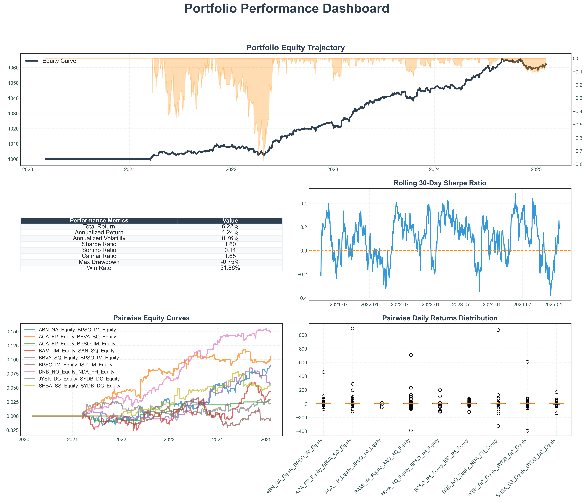

# 📈 Statistical Arbitrage Trading Strategy


---

## Overview  
A **machine learning-driven statistical arbitrage system** that identifies **cointegrated asset pairs** and executes trades using **dual-pipeline models with meta-labelling** for enhanced signal accuracy.  
The strategy is **market-neutral**, uses **advanced risk management**, and is designed for **scalable deployment**.

---

## Quick Start

```bash
# Clone the repository
git clone <repository-url>
cd statistical-arbitrage

# Install dependencies
pip install -r requirements.txt

# Run the strategy
python StatArb.py
```

## Performance Metrics

| Metric             | Value          |
|--------------------|----------------|
| Annualized Return  | 1.24%          |
| Sharpe Ratio       | 1.60           |
| Max Drawdown       | -0.75%         |
| Win Rate           | 51.86%         |
| Strategy Type      | Market-Neutral |



## Architecture & Methodology
**Pairs Selection** <br />
DBSCAN & OPTICS clustering to identify cointegrated asset pairs

Statistical testing for cointegration relationships

Dynamic pair correlation analysis

**Feature Engineering & Selection** <br />
Multicollinearity testing using Variance Inflation Factor (VIF)

XGBoost feature importance ranking for optimal input selection

Rolling window feature calculations for time-series stability

**Dual-Pipeline ML Models** <br />
Primary Signal Generation: Logistic regression classifier for initial trade signals

Meta-Labelling Refinement: LSTM model validates and refines signals from the primary classifier

Probability Calibration with Platt scaling for reliable probabilistic outputs

**Risk Management & Position Sizing** <br />
Custom Kelly Criterion: Volatility-adjusted position sizing based on market conditions

Purged K-Fold Cross-Validation to eliminate look-ahead bias

Dynamic stop-loss and take-profit: Adaptive risk controls based on z-score movements

## Tech Stack
**Component:**	Technology <br />
**Language:**	Python 3.8+ <br />
**ML/Data:**	scikit-learn, XGBoost, TensorFlow <br />
**Analysis:**	pandas, NumPy, scipy <br />
**Visualization:**	matplotlib, seaborn <br />
**Research Frameworks:**	Hudson & Thames, Marcos López de Prado <br />

## Project Structure
```bash
Copy
Edit
statistical-arbitrage/
├── StatArb.py                                   # Main execution script
├── Pair_Identification/PairSelection.py         # Clustering & cointegration testing
├── Features/Labelling.py                        # Target labelling methodology
├── Features/Feature_Importance.py               # Feature selection & VIF testing
├── ML_Models.py                                 # Dual-pipeline model implementation
├── ML_Model_Trainer.py                          # Training models
├── Backtest.py                                  # Strategy backtesting & performance
├── Portfolio/                                   # Performance visualizations
├── Data/data_fetch.py                           # Fetch and Process data from CSV
└── requirements.txt                             # Project dependencies
```

## Configuration & Customization
Core Parameters
Modify these to adjust strategy behaviour:

# StatArb.py - Rolling spread window
rolling_window = 30

# Labelling.py, Feature_Importance.py, ML-Models.py - Target labelling
self.period = 10    # Labelling period <br />
self.SR = 0.02      # Sharpe ratio threshold 
self.RF = 0.01      # Risk-free rate

# Backtest.py - Risk management
z_score_volatility = 2.0    # Kelly criterion volatility threshold <br />
weight_kelly = 0.5          # Kelly position weight multiplier <br />

Advanced Customization <br />

Switch clustering method (DBSCAN/OPTICS) in PairSelection.py

Modify stop-loss / take-profit based on cumulative return or z-score in Backtest.py

Adjust long_condition & short_condition filters in Backtest.py

## Research Foundation
This implementation draws from:

Advances in Financial Machine Learning by Marcos López de Prado

Hudson & Thames quantitative research frameworks

Academic literature on statistical arbitrage and meta-labelling

Proprietary research on volatility-based position sizing

## Future Roadmap
Enhanced project structure with intuitive modules

Advanced meta-labelling with ensemble models

More predictive feature engineering

Expanding asset universe for diverse pairs

Intraday implementation with higher frequency data

Real-time deployment and risk monitoring