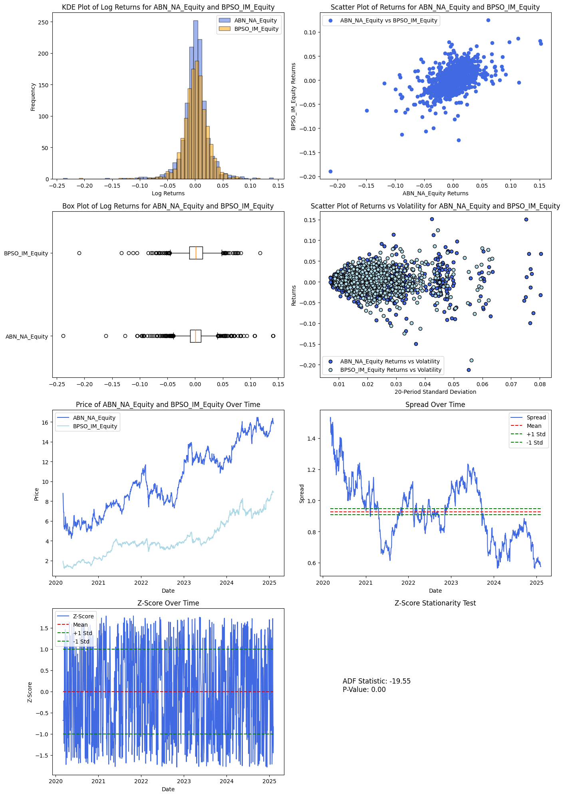
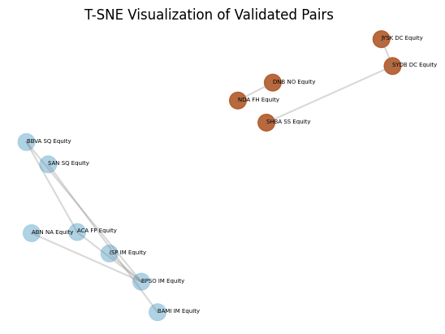
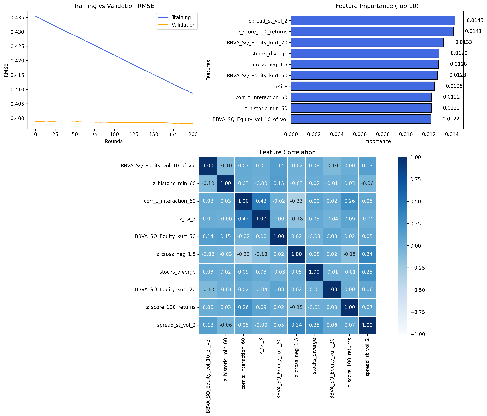
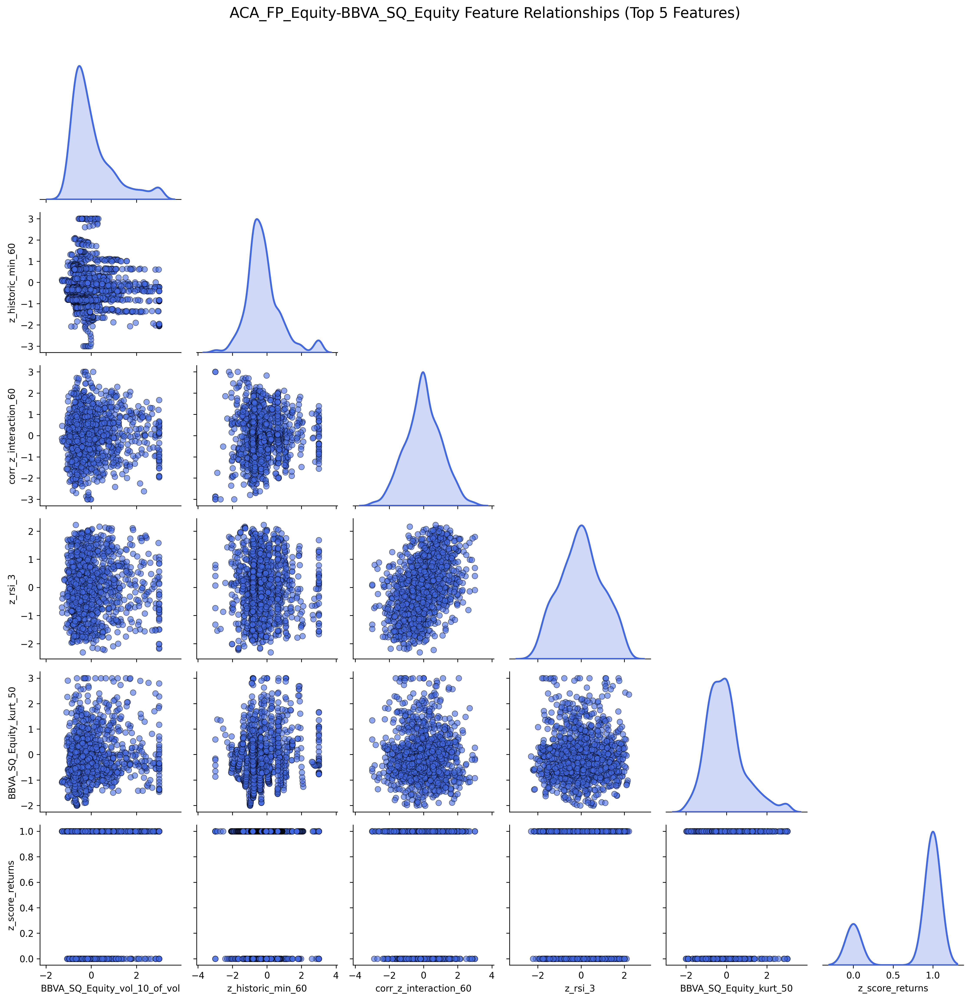

# 📈 Statistical Arbitrage Trading Strategy


---

## Overview  
A **machine learning-driven statistical arbitrage system** that identifies **cointegrated asset pairs** and executes trades using **dual-pipeline models with meta-labelling** for enhanced signal accuracy.  
The strategy is **market-neutral**, uses **advanced risk management**, and is designed for **scalable deployment**.

---

## Quick Start

```bash
# Clone the repository
git clone <repository-url>
cd statistical-arbitrage

# Install dependencies
pip install -r requirements.txt

# Run the strategy
python StatArb.py
```

## Performance Metrics

| Metric             | Value          |
|--------------------|----------------|
| Annualized Return  | 1.24%          |
| Sharpe Ratio       | 1.60           |
| Max Drawdown       | -0.75%         |
| Win Rate           | 51.86%         |
| Strategy Type      | Market-Neutral |


## Architecture & Methodology
**Pairs Selection** <br />
DBSCAN & OPTICS clustering to identify cointegrated asset pairs

Statistical testing for cointegration relationships

Dynamic pair correlation analysis

**Feature Engineering & Selection** <br />
Multicollinearity testing using Variance Inflation Factor (VIF)

XGBoost feature importance ranking for optimal input selection

Rolling window feature calculations for time-series stability

**Dual-Pipeline ML Models** <br />
Primary Signal Generation: Logistic regression classifier for initial trade signals

Meta-Labelling Refinement: LSTM model validates and refines signals from the primary classifier

Probability Calibration with Platt scaling for reliable probabilistic outputs

**Risk Management & Position Sizing** <br />
Custom Kelly Criterion: Volatility-adjusted position sizing based on market conditions

Purged K-Fold Cross-Validation to eliminate look-ahead bias

Dynamic stop-loss and take-profit: Adaptive risk controls based on z-score movements

## Tech Stack
**Component:**	Technology <br />
**Language:**	Python 3.8+ <br />
**ML/Data:**	scikit-learn, XGBoost, TensorFlow <br />
**Analysis:**	pandas, NumPy, scipy <br />
**Visualization:**	matplotlib, seaborn <br />
**Research Frameworks:**	Hudson & Thames, Marcos López de Prado <br />

## Project Structure
```bash
statistical-arbitrage/
├── StatArb.py                                   # Main execution script
├── Pair_Identification/PairSelection.py         # Clustering & cointegration testing
├── Features/Labelling.py                        # Target labelling methodology
├── Features/Feature_Importance.py               # Feature selection & VIF testing
├── ML_Models.py                                 # Dual-pipeline model implementation
├── ML_Model_Trainer.py                          # Training models
├── Backtest.py                                  # Strategy backtesting & performance
├── Portfolio/                                   # Performance visualizations
├── Data/data_fetch.py                           # Fetch and Process data from CSV
└── requirements.txt                             # Project dependencies
```

## Modifying Results:

1. Modify the rolling spread calculation in StatArb.
2. Modify the parameters that go into the target labelling. (self.period, self.SR, self.RF). These are found in: Labelling.py, Feature_Importance.py & ML-Models.py.
3. Modify the parameters in Backtest.py. Most are found in init, however, make sure to modify z_score_volatility in the kelly criterion method. 
4. Can modify the kelly weighting (weight_kelly) in the kelly criterion method in Backtest.py 
5. Can also modify the pair selection ML method in PairSelection.py. (DBSCAN or Optics) 
6. Can modify the stop loss and take profit criteria (based on cumualtive return or z_score movement) in Backtest.py. 
7. Can modify the filter for trading in Backtest.py (long_condition & short_condition)

## Research Foundation
This implementation draws from:

Advances in Financial Machine Learning by Marcos López de Prado

Hudson & Thames quantitative research frameworks

Academic literature on statistical arbitrage and meta-labelling

Proprietary research on volatility-based position sizing

## Future Roadmap
Enhanced project structure with intuitive modules

Advanced meta-labelling with ensemble models

More predictive feature engineering

Expanding asset universe for diverse pairs

Intraday implementation with higher frequency data

Real-time deployment and risk monitoring

## EDA



## Pair Plot



## Feature Importance



